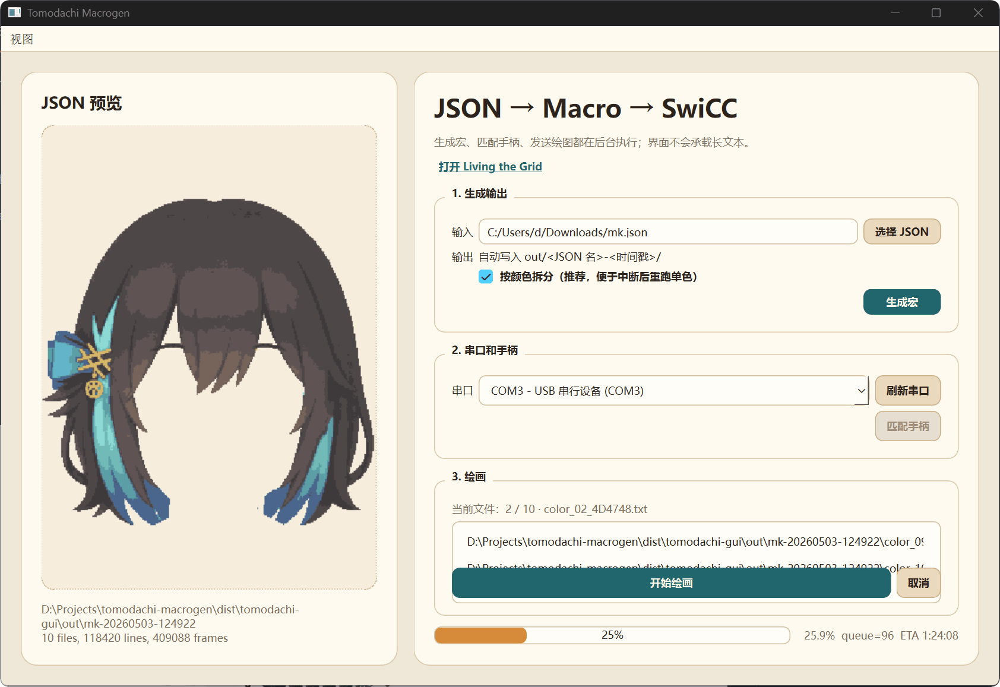

# tomodachi-macrogen

把 [Living the Grid](https://living-the-grid.com/) 导出的 JSON 转成 SwiCC `.txt` 宏，用于 Tomodachi Life 面部彩绘自动绘制。

English documentation: [README.md](README.md). 更新记录见 [CHANGELOG.md](CHANGELOG.md)。

## 下载

免安装 GUI 包发布在
[GitHub Releases 页面](https://github.com/txfs19260817/tomodachi-macrogen/releases)。
下载对应平台的最新 asset，解压后直接运行：

- Windows：`tomodachi-gui/tomodachi-gui.exe`
- macOS：`tomodachi-gui.app`
- Linux：`tomodachi-gui/tomodachi-gui`

不会生成安装器。产物未签名，Windows/macOS 首次运行时可能会有系统提示。

## 基本流程

1. 在 Living the Grid 上传图片。
2. 选择目标画布 preset、`smooth`、`1px / 3px / 7px / 13px / 19px / 27px` 之一、`game` palette。
3. 设置 `max colours`，例如 `12`。
4. 导出 `JSON (per-pixel data)`。
5. 打开 `tomodachi-gui`，选择 JSON，生成宏。
6. 选择串口，需要时先匹配手柄，然后开始绘画。



## 游戏内检查

运行生成文件前：

1. 进入 Tomodachi Life 的 face paint 绘制界面。
2. 把游戏内画笔重置为 `1 px`。
3. 如果使用 84 色模式，确认 84 色板起点是左下角黑色（`R7C1`）。如果使用全色 / HSB 模式，完成画笔重置即可。
4. 按文件名顺序运行生成的 `color_*.txt`。
5. 生成的文件之间不要手动切换当前色板格。

非 84 色输出可以在 GUI 里取消勾选某些颜色文件，用来跳过已经手动油漆桶填充的背景色。84 色输出不允许跳过文件，因为色板导航依赖上一个文件选中的颜色。

每个 `color_*.txt` 开头都会把画笔硬复位到画布起点。Book cover、TV screen、Video game、Interior Wallpaper/floor 会根据 JSON 里的 `canvas.w/h` 自动居中起笔。如果 JSON 颜色带 84 色盘坐标，宏会用 `Y Y L1` 打开 84 色 Game Palette，并从左下角黑色或上一次选中的 84 色位置相对移动；其它颜色会进入 HSB 选色器并使用 JSON 里的 `press.h/s/b`。

## 硬件设置

固件：

- SwiCC_RP2040：<https://github.com/knflrpn/SwiCC_RP2040/releases>
- UART bridge：<https://github.com/knflrpn/SwiCC_RP2040/blob/main/documentation/SwiCC_UART_Bridge.uf2>

烧录 UF2：按住 `BOOTSEL` 插 USB，出现 `RPI-RP2` U 盘后复制对应 `.uf2`。Switch 系统设置里需要打开 Pro Controller Wired Communication。

- A 板插 Switch / Dock，烧录 SwiCC_RP2040 主固件，表现为 Switch Pro Controller。
- B 板插电脑，烧录 `SwiCC_UART_Bridge.uf2`，作为 USB-UART bridge。
- A GPIO0/TX 接 B GPIO1/RX。
- A GPIO1/RX 接 B GPIO0/TX。
- A GND 接 B GND。
- 不要连接两块板之间的 5V 或 3V3。
- Waveshare RP2040-Zero 按 GPIO 标号接线，不要按物理位置猜。


## 输出

生成结果固定写入 `out/<JSON 文件名>-<时间戳>/`。

- `color_XX_*.txt`：每个用到的颜色一个宏文件，需要按文件名顺序运行。
- `preview_quantized.png`：按 JSON 还原的预览。
- `reconstructed_from_macro.png`：按宏绘制坐标重建的图，用来检查路径计划。
- `palette_report.csv`：颜色、H/S/B、像素数和 slot 分配。
- `manifest.json`：生成摘要。
- `config_used.json`：实际使用配置。
- `README_RUN.md` / `README_RUN-en.md`：运行说明。

## CLI

普通使用建议优先使用 GUI。CLI 适合自动化或手动用 SwiCC 发送文件。

常用命令：

```bash
# 查看串口
uv run tomodachi-macrogen --list-ports

# 生成、匹配手柄、开始绘画
uv run tomodachi-macrogen input.json --port COM5

# 单独匹配手柄
uv run tomodachi-macrogen --port COM5 --match-controller

# 生成文件，稍后再发送
uv run tomodachi-macrogen input.json

# 清理输出和缓存
uv run tomodachi-clean
```

参数：

- `input`：Living the Grid JSON。
- `--port COM5`：通过指定串口生成、匹配手柄并绘画。
- `--list-ports`：列出可用串口。
- `--match-controller`：不提供 JSON 时，单独执行匹配手柄步骤。
- `--config CONFIG`：额外配置，会覆盖 `config.default.json`。
- `--color-order frequency|original-palette|luminance|hue`：颜色文件顺序，默认 `original-palette`。
- `--diagonal-movement`：实验性画布斜向移动。
- `--clean-output`：删除 `out/` 下的生成结果。
- `--clean-cache`：删除 `.ruff_cache`、`__pycache__` 等缓存。

手动发送生成文件时，可以删除不想发送的 `color_*.txt` 来跳过已经填好的非 84 色颜色。84 色输出不要删除或跳过文件。

每个颜色会先 dry-run 比较 nearest-run、逐行 snake、有限规模 TSP/2-opt 路径，再写入耗时更短的结果。

## 配置

默认配置在 `config.default.json`，当前默认值偏慢，优先保证实机不漏步。

常调字段：

- `timing.*`：按键、移动、菜单等待时间。
- `game_palette_*`：Game Palette 导航尺寸和等待时间。
- `movement_chunk_size` / `movement_chunk_settle_frames`：长距离移动时分块停顿。
- `enable_diagonal_movement`：实验性组合方向键移动；实机确认稳定前建议保持关闭。
- `path_tsp_max_runs`：TSP/2-opt 候选最多处理的水平连续段数量。
- `canvas_reset_right_steps` / `canvas_reset_down_steps`：`color_*.txt` 开头硬复位后的回退步数。
- `timing.canvas_reset_*`：`color_*.txt` 开头硬复位的摇杆保持和停顿时间。

## 开发设置

```bash
uv venv --python 3.13
uv sync
```

开发检查：

```bash
uv sync --group dev --group test
uv run ruff check .
uv run pytest -n auto tests
```

Benchmark：

```bash
uv sync --group benchmark
uv run --group benchmark pytest benchmarks --benchmark-only
uv run --group benchmark pytest benchmarks/test_planner_strategy_benchmark.py --benchmark-only
uv run --group benchmark pytest benchmarks/test_tsp_limit_benchmark.py --benchmark-only
```

## 本地构建 Portable GUI

```bash
uv sync --group build
uv run --group build tomodachi-build-gui
```

构建结果在 Windows/Linux 上写到 `dist/tomodachi-gui/`，在 macOS 上写到
`dist/tomodachi-gui.app`。`tomodachi-build-gui` 默认会删除 PyInstaller 中间产物；
如果需要保留 `build/` 和 `tomodachi-gui.spec` 排查问题，传入 `--keep-build`。

GitHub Actions 工作流 `.github/workflows/python-app.yml` 会分别在 Windows、macOS、Linux
上构建免安装 GUI 压缩包。可以在 Actions 页面手动运行，也可以推送 `vX.Y.Z` 这类语义化版本 tag 触发。

## Git 工作流

提交标题用 Commitizen 检查，格式使用 Conventional Commits。第一次启用仓库内的 git hook：

```bash
git config core.hooksPath .githooks
```

示例：`feat: add GUI color swatch`、`fix: close run instructions dialog`、`docs: update release notes`。

post-commit hook 会用 git-cliff 重新生成 `CHANGELOG.md`，并 amend 到同一个提交里。每次提交后先检查工作树再 push；`mmx.json` 这类生成输入应保持未跟踪，除非明确要作为 fixture 提交。

```bash
# 提交本地改动
git status --short
git add <files-you-intend-to-commit>
git commit -m "fix: describe the behavior"
git status --short

# 推送当前分支
git push origin main

# 只推送已有 tag
git push origin <tag>
```

发布补丁版本：

```bash
uv run --group dev cz bump --increment PATCH --yes
uv run tomodachi-check-version --tag <tag>
git push origin main <tag>
```

如果 bump commit 之后 `uv.lock` 还有改动，把它 amend 进 release commit，并在 push 前移动本地 tag：

```bash
git add uv.lock
git commit --amend --no-edit
git tag -f <tag>
uv run tomodachi-check-version --tag <tag>
git push origin main <tag>
```

只预览尚未发布的 changelog，不写入文件：

```bash
uv run --group dev git-cliff --config pyproject.toml --unreleased
```

tag 发布会经过 CI 校验：`vX.Y.Z` 必须和 `pyproject.toml` 里的项目版本一致，然后 GitHub Actions 会把 portable 压缩包发布成 Release assets。

## 参考链接

- Living the Grid：<https://living-the-grid.com/>
- SwiCC_RP2040：<https://github.com/knflrpn/SwiCC_RP2040>
- Waveshare RP2040-Zero pinout：<https://mischianti.org/wp-content/uploads/2022/09/Waveshare-rp2040-zero-Raspberry-Pi-Pico-alternative-pinout.jpg>
- TomodachiDraw 选色器导航参考：<https://github.com/Xenthio/TomodachiDraw/blob/master/TomodachiDraw/Services/CanvasNavigatorService.cs>
